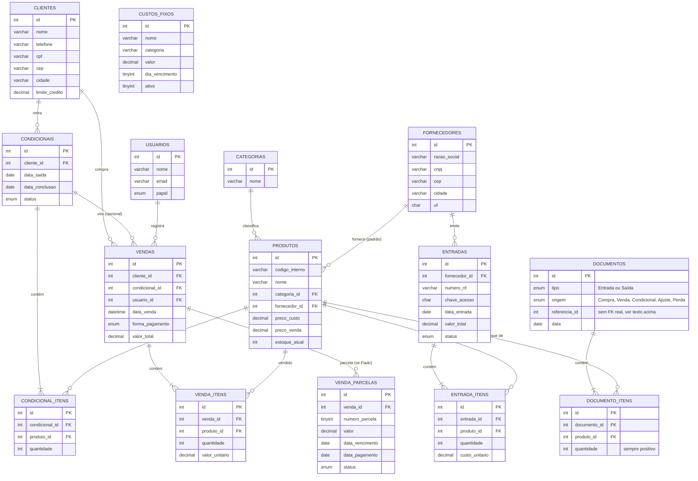

# Banco de dados do ModaSys

Estrutura relacional para MySQL/MariaDB, pensada para rodar local
no MySQL do XAMPP enquanto a hospedagem não é contratada.

## Como usar

```bash
mysql -u root -p < schema.sql
mysql -u root -p modasys < seed.sql
```

O `schema.sql` cria o banco `modasys` e as tabelas. O `seed.sql` é
opcional — só insere os mesmos dados que hoje estão mockados nos
arrays PHP, para dar pra testar consultas reais antes de trocar o
front-end de vez.

## Por que essas tabelas

Cada tabela existe porque uma tela do sistema já precisa dela — não
tem nada especulativo demais aqui, é o banco "seguindo" o que o
front-end já mostra:

| Tabela | Tela que originou |
|---|---|
| `fornecedores` | fornecedores.php |
| `clientes` | clientes.php |
| `categorias` | combo "Categoria" em produtos.php |
| `produtos` | produtos.php |
| `entradas` + `entrada_itens` | entradas.php (Nota Fiscal de compra) |
| `condicionais` + `condicional_itens` | condicionais.php |
| `vendas` + `venda_itens` | vendas.php (PDV) e os KPIs do dashboard |
| `venda_parcelas` | contas-a-receber.php (vendas "Fiado") |
| `custos_fixos` | custos-fixos.php |
| `documentos` + `documento_itens` | inventario.php, e por baixo dos panos de entradas/vendas/condicionais |
| `usuarios` | login.php (login ainda não está ligado ao banco) |

## Decisões de modelagem (para explicar na banca)

**Categoria virou tabela, não texto solto.** Antes, `produtos.php`
guardava "Vestidos", "Calças" etc. como texto livre em cada produto.
Isso deixa fácil digitar errado ("Vestido" vs "Vestidos") e difícil
renomear uma categoria depois. Uma tabela `categorias` com
`produtos.categoria_id` como chave estrangeira resolve os dois
problemas — é o exemplo mais simples de normalização para mostrar.

**Preço de venda é fotografado na venda, não é sempre o preço atual.**
`venda_itens.valor_unitario` guarda o preço no momento daquela venda.
Se o preço do produto mudar amanhã, o histórico de vendas antigas não
pode mudar junto — por isso não é só uma referência a
`produtos.preco_venda`, é uma cópia do valor daquele instante.

**Estoque é um saldo em cache, atualizado por uma trigger — não por
código PHP espalhado.** `produtos.estoque_atual` guarda o saldo
atual (recalcular somando todo o histórico a cada tela ficaria lento
com o tempo). A parte importante é *como* esse saldo é mantido
atualizado: existe uma tabela `documentos` (cabeçalho: é Entrada ou
Saída, e de onde veio — Compra, Venda, Condicional, Ajuste de
Inventário, Perda/Avaria) e `documento_itens` (produto + quantidade
movimentada). Uma trigger `AFTER INSERT ON documento_itens` soma ou
subtrai `produtos.estoque_atual` automaticamente.

Por que um "ledger" (ideia emprestada de livro-razão contábil) em vez
de cada tela mexer direto na coluna: se amanhã existir uma quinta
forma de tirar peça do estoque que ninguém previu hoje, ela só
precisa inserir em `documentos` — não precisa lembrar de replicar uma
regra de "subtrair estoque" em mais um lugar do código. E pra auditar
todo movimento que uma peça já sofreu, basta consultar essa tabela
única, sem cruzar `entrada_itens` + `venda_itens` + `condicional_itens`.

Essas outras tabelas (`entrada_itens`, `venda_itens`,
`condicional_itens`) continuam existindo — elas guardam o dado de
*negócio* de cada operação (preço, custo, desconto, forma de
pagamento), que não faz sentido morar em `documentos`. As duas
coisas coexistem: uma entrada processada grava uma linha em
`entrada_itens` (pra saber quanto custou) **e** uma em
`documento_itens` (pra afetar o estoque). É por isso que o
`seed.sql` insere as duas coisas separadamente — dá pra ver isso
acontecendo nos dados de exemplo.

`referencia_id` em `documentos` aponta pro id de origem (a entrada,
venda ou condicional), mas não é uma foreign key de verdade: a
tabela de destino muda dependendo da coluna `origem`, e o MySQL não
tem FK polimórfica. Fica `NULL` em ajustes manuais de inventário ou
perdas, que não vêm de nenhuma tabela de negócio.

**Desconto é salvo em reais, o percentual é só uma calculadora na
tela.** No PDV dá pra digitar "% Desc." em cada item e também um
desconto geral da venda — mas o banco só guarda o valor em reais
resultante (`venda_itens.valor_desconto` e `vendas.valor_desconto`).
É o mesmo raciocínio do "% Lucro" em entradas.php: o percentual
ajuda a preencher rápido, o que importa pra relatório e conferência
de caixa é o valor final, não a fórmula que chegou nele.

**`parcelas_cartao` é só informativo.** Guarda em quantas vezes o
cliente parcelou no cartão, mas isso não afeta `valor_total` nem cria
linhas em nenhuma tabela — quem financia o parcelamento é a operadora
do cartão, a loja recebe o valor cheio (menos a taxa, que este sistema
não calcula). É bem diferente de `venda_parcelas`: aquela é dívida
real do cliente com a loja (fiado); esta é só um registro de como o
pagamento foi feito.

**Fiado é parcela, não é só uma forma de pagamento a mais.** Uma
venda "Fiado" gera de 1 a N linhas em `venda_parcelas`, cada uma com
seu próprio vencimento e status (`Pendente`/`Paga`). Isso existe
porque uma venda fiada não é "concluída" no ato — ela só termina de
verdade quando a última parcela é paga. Por isso não basta usar as
mesmas colunas de uma venda à vista.

**Atraso é calculado, não é um status gravado.** `venda_parcelas`
não tem um status `Atrasada` — uma parcela é `Pendente` até ser
paga, e a tela de Contas a Receber decide se mostra "atrasada"
comparando `data_vencimento` com a data de hoje na hora da consulta.
Gravar isso numa coluna exigiria um processo rodando todo dia só pra
atualizar o status; calcular no `SELECT` nunca fica desatualizado e
é mais simples de manter.

**`limite_credito` em `clientes` decide quem pode comprar fiado.**
Fica `NULL` por padrão (sem fiado liberado). Quando preenchido, é
o teto de dívida em aberto que aquele cliente pode ter ao mesmo
tempo — a validação ("essa venda estouraria o limite?") acontece na
aplicação na hora de fechar a venda, comparando com a soma das
parcelas `Pendente` daquele cliente.

**`cliente_id` e `condicional_id` em `vendas` aceitam NULL.**
`cliente_id` nulo representa o "Cliente Balcão" do PDV — nem toda
venda tem um cliente cadastrado. A exceção é a venda "Fiado": nesse
caso `cliente_id` nulo não faz sentido (não tem pra quem cobrar
depois), então a aplicação exige um cliente real antes de liberar
essa forma de pagamento no PDV. `condicional_id` só é preenchido
quando a venda nasce de um "Finalizar Venda" em condicionais.php;
a maioria das vendas não vem de uma condicional, então fica nulo.

**Os campos de Nota Fiscal em `entradas` batem com o formulário
atual.** Número, série, chave de acesso, transporte, totais (frete,
seguro, ICMS, IPI...) — são exatamente as seções que já existem em
"Nova Entrada de Produtos". Quando o botão de importar XML for
construído, o mapeamento é direto: cada tag do XML da NF-e cai numa
coluna que já existe.

**Endereço de `fornecedores` e `clientes` é estruturado, não um
campo de texto único.** CEP, logradouro, número, complemento, bairro,
cidade e UF ficam em colunas separadas porque o front-end preenche
boa parte disso automaticamente: o CEP consulta a API ViaCEP e
preenche logradouro/bairro/cidade/UF, e no fornecedor o CNPJ consulta
a BrasilAPI e preenche razão social + endereço completo de uma vez.
Guardar em colunas separadas é o que permite, por exemplo, filtrar
fornecedores por UF num relatório futuro — um campo de texto único
não permitiria isso sem parsing.

## Diagrama



## Próximos passos naturais

- Trocar os arrays `$produtos`, `$clientes` etc. nos `.php` por
  consultas (`SELECT`) neste banco, uma tela de cada vez.
- Criar `config/database.php` com a conexão PDO, reaproveitada por
  todas as páginas.
- Só depois disso, ligar o `login.php` de verdade à tabela `usuarios`
  (hoje ele só existe visualmente, sem sessão nem senha checada).
