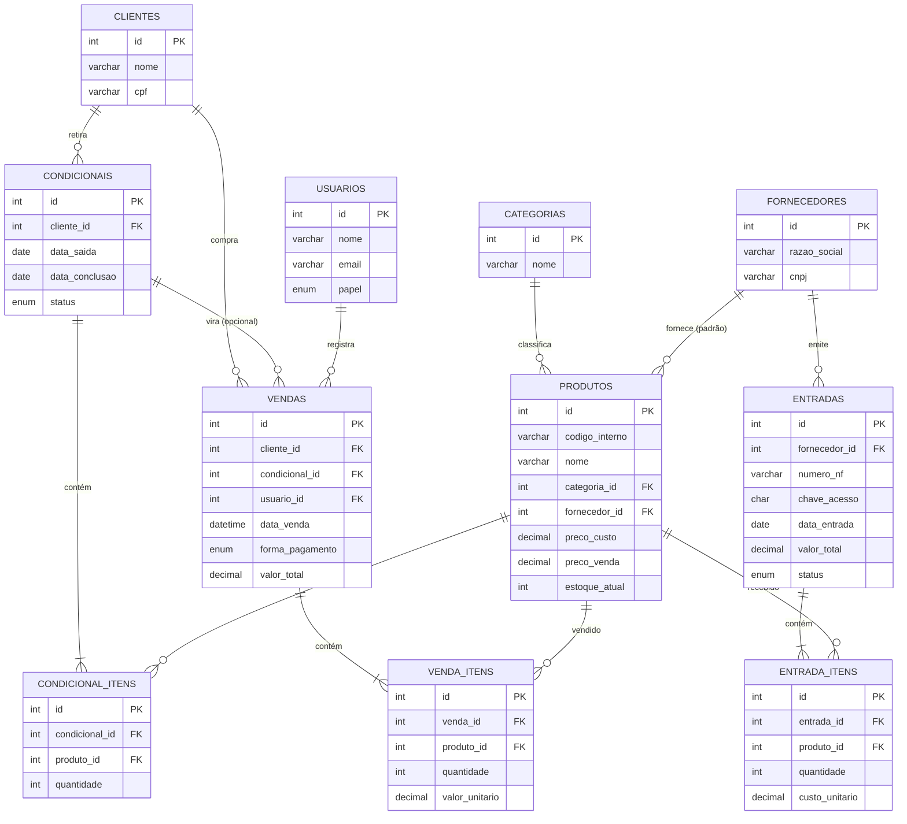

# Banco de dados do ModaSys

Estrutura relacional para MySQL/MariaDB, pensada para rodar local
no MySQL do XAMPP enquanto a hospedagem não é contratada.

## Como usar

```bash
mysql -u root -p < schema.sql
mysql -u root -p modasys < seed.sql
```

O `schema.sql` cria o banco `modasys` e as tabelas. O `seed.sql` é
opcional — só insere os mesmos dados que hoje estão mockados nos
arrays PHP, para dar pra testar consultas reais antes de trocar o
front-end de vez.

## Por que essas tabelas

Cada tabela existe porque uma tela do sistema já precisa dela — não
tem nada especulativo demais aqui, é o banco "seguindo" o que o
front-end já mostra:

| Tabela | Tela que originou |
|---|---|
| `fornecedores` | fornecedores.php |
| `clientes` | clientes.php |
| `categorias` | combo "Categoria" em produtos.php |
| `produtos` | produtos.php |
| `entradas` + `entrada_itens` | entradas.php (Nota Fiscal de compra) |
| `condicionais` + `condicional_itens` | condicionais.php |
| `vendas` + `venda_itens` | vendas.php (PDV) e os KPIs do dashboard |
| `usuarios` | login.php (login ainda não está ligado ao banco) |

## Decisões de modelagem (para explicar na banca)

**Categoria virou tabela, não texto solto.** Antes, `produtos.php`
guardava "Vestidos", "Calças" etc. como texto livre em cada produto.
Isso deixa fácil digitar errado ("Vestido" vs "Vestidos") e difícil
renomear uma categoria depois. Uma tabela `categorias` com
`produtos.categoria_id` como chave estrangeira resolve os dois
problemas — é o exemplo mais simples de normalização para mostrar.

**Preço de venda é fotografado na venda, não é sempre o preço atual.**
`venda_itens.valor_unitario` guarda o preço no momento daquela venda.
Se o preço do produto mudar amanhã, o histórico de vendas antigas não
pode mudar junto — por isso não é só uma referência a
`produtos.preco_venda`, é uma cópia do valor daquele instante.

**Estoque é um saldo em cache, não uma soma recalculada toda hora.**
`produtos.estoque_atual` guarda o saldo atual. A alternativa seria
somar todas as entradas e subtrair todas as vendas/condicionais a
cada vez que a tela abre — funciona, mas fica lento conforme o
histórico cresce. Por isso o saldo é mantido atualizado a cada
transação (entrada soma, venda subtrai, condicional sai e volta se
for devolvida).

**`cliente_id` e `condicional_id` em `vendas` aceitam NULL.**
`cliente_id` nulo representa o "Cliente Balcão" do PDV — nem toda
venda tem um cliente cadastrado. `condicional_id` só é preenchido
quando a venda nasce de um "Finalizar Venda" em condicionais.php;
a maioria das vendas não vem de uma condicional, então fica nulo.

**Os campos de Nota Fiscal em `entradas` batem com o formulário
atual.** Número, série, chave de acesso, transporte, totais (frete,
seguro, ICMS, IPI...) — são exatamente as seções que já existem em
"Nova Entrada de Produtos". Quando o botão de importar XML for
construído, o mapeamento é direto: cada tag do XML da NF-e cai numa
coluna que já existe.

## Diagrama



## Próximos passos naturais

- Trocar os arrays `$produtos`, `$clientes` etc. nos `.php` por
  consultas (`SELECT`) neste banco, uma tela de cada vez.
- Criar `config/database.php` com a conexão PDO, reaproveitada por
  todas as páginas.
- Só depois disso, ligar o `login.php` de verdade à tabela `usuarios`
  (hoje ele só existe visualmente, sem sessão nem senha checada).
